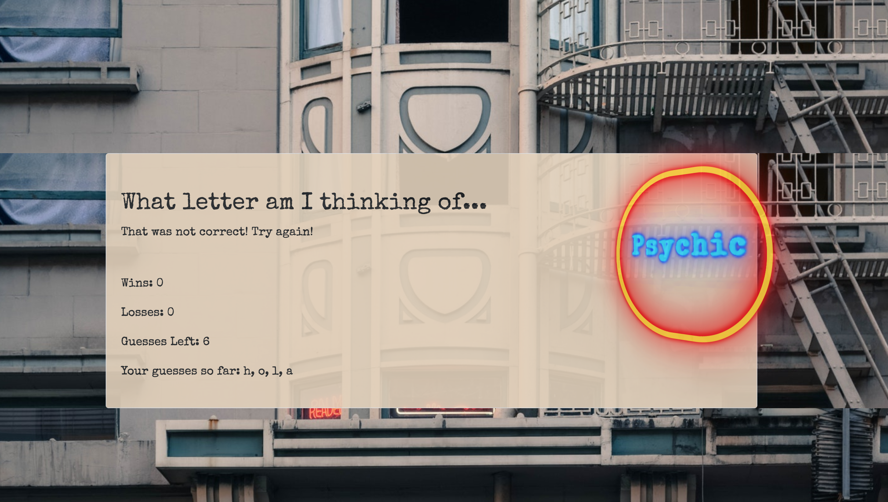

# Psychic-Game
Psychic Game, 
Guessing numbers while implementing Javascript with CSS, and HTML.

This is a game where you have to guess what letter the computer is thinking of. Every time you type 'one' letter it will print out on the page whether you are wrong or right. It will also give you the amount of losses & wins with the amount of tries you have left. 

This game will automatically reset when you lose or win by typing in another letter.

Psuedocode notes put throughout to understand functionality of specific areas of code.

Wk 2 Assignment 4 - UCB

<a href="https://blonded.github.io/Psychic-Game/" alt="DEMO"> "DEMO" </a>

Installing
Download repository on GitHub, open in preferred text editor to view source code (i.e. Atom, Sublime, Visual Studio Code). Open index.html, style.css, and game.js. Right click on the html file code and select "view in default browser" to view a demo of the website created. (Google Chrome Preferred for viewing)

index.html
style.css
game.js
README.md

Sample of JavaScript used:

This function creates a random number and converts it using the Ascii number chart to then create a letter, A-Z (lowercase only).

'''''
function generator(){
    // may need to lowercase the computer guess
    // use ascii value of letter
    return String.fromCharCode(
        Math.floor(Math.random() * 26) + 97
      )
}

// for testing, computer initial guess
console.log(gameData.computerGuess);

'''''

## Built With

* [html]
* [css]
* [javascript]

## Authors

* **Lena Martinson** - *Github* - [Github](https://github.com/Blonded)
* **Google Fonts** - *GoogleFonts* - [Google Fonts](https://fonts.google.com/)
